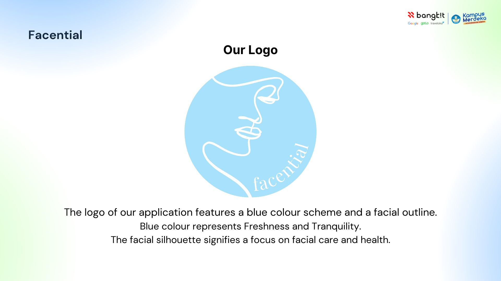
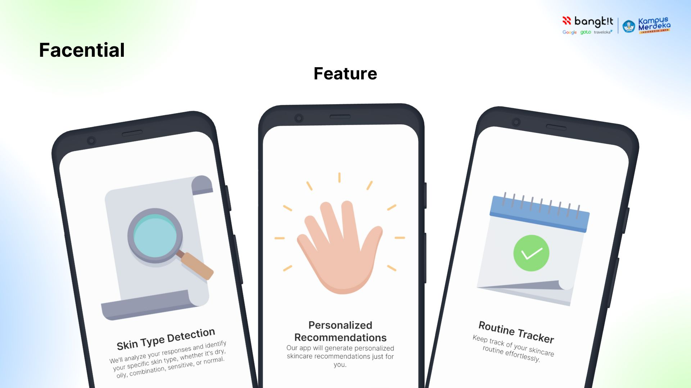
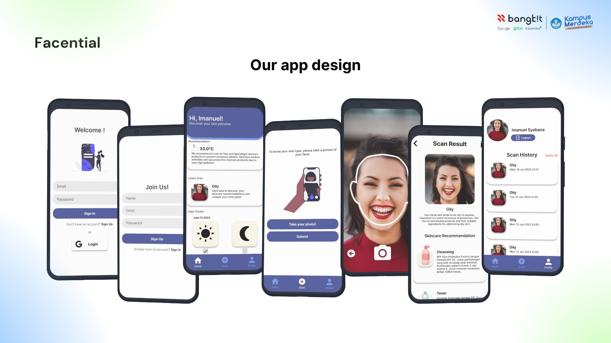

| Library                       | Description                                                                                                         |
|-------------------------------|---------------------------------------------------------------------------------------------------------------------|
| Firebase                      | The library provides functionalities for user registration and login.                                               |
| CameraX                       | Utilizes the CameraX library to capture images within the application.                                              | 
| Navigation                    | Integrates with the Navigation library to manage application navigation and dynamic feature fragments.              |
| Retrofit                      | Handles network requests and communication with the backend using the Retrofit library.                             |
| Pager and Indicators          | Uses the Accompanist library to implement pagers and indicators for enhanced user interface design.                 |
| Circle Image                  | Implements the CircleImageView library to display circular images.                                                  |
| Glide                         | Uses the Glide library for efficient image loading and caching.                                                     |
| Google Play Service Location  | Integrates with the Google Play Services Location API to access location-related functionalities.                   |
